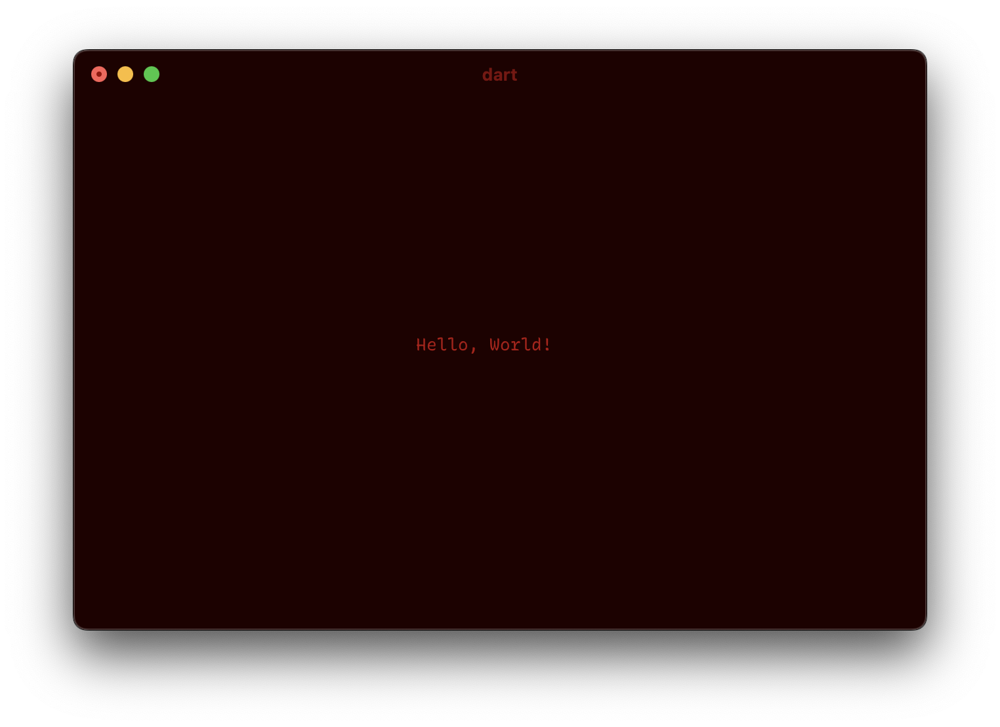
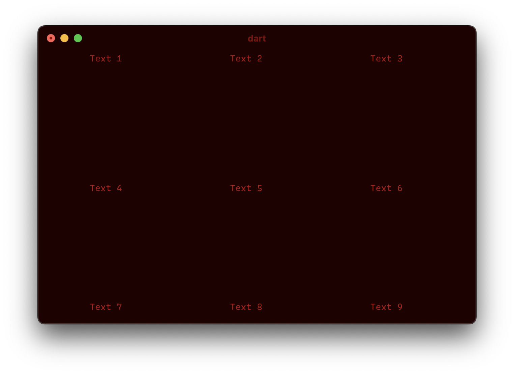

# Flutter TUI

> [!WARNING]
> Work in progress.

Imagine writing terminal user interfaces with Flutter's syntax!

```dart
void main() async {
  await runApp(Center(child: Text("Hello, World!")))
}
```


```dart
void main() async {
  await runApp(Center(
    child: Column(
      mainAxisAlignment: AxisAlignment.center,
      children: [
        Row(
          mainAxisAlignment: AxisAlignment.center,
          children: [
            for (int i = 0; i < 3; i++)
              Text("Text ${i+1}")
          ]
        ),
        Row(
          mainAxisAlignment: AxisAlignment.center,
          crossAxisAlignment: AxisAlignment.center,
          children: [
            for (int i = 3; i < 3+3; i++)
              Text("Text ${i+1}")
          ]
        ),
        Row(
          mainAxisAlignment: AxisAlignment.center,
          crossAxisAlignment: AxisAlignment.end,
          children: [
            for (int i = 3+3; i < 3+3+3; i++)
              Text("Text ${i+1}")
          ]
        ),
      ]
    )
  ));
}
```


## TODO
- [ ] Implement stateful widgets.
- [ ] Add `Expanded` widget and enhance layout algorithm
- [ ] Enter raw mode, so control keys don't send default signals
- [ ] Add `KeyboardListener` widget
- [ ] Add a `TextField` widget
- [ ] Add 'overflow' and 'style' properties to `Text` widget
- [ ] Add `SizedBox` widget
- [ ] Add `Padding` widget